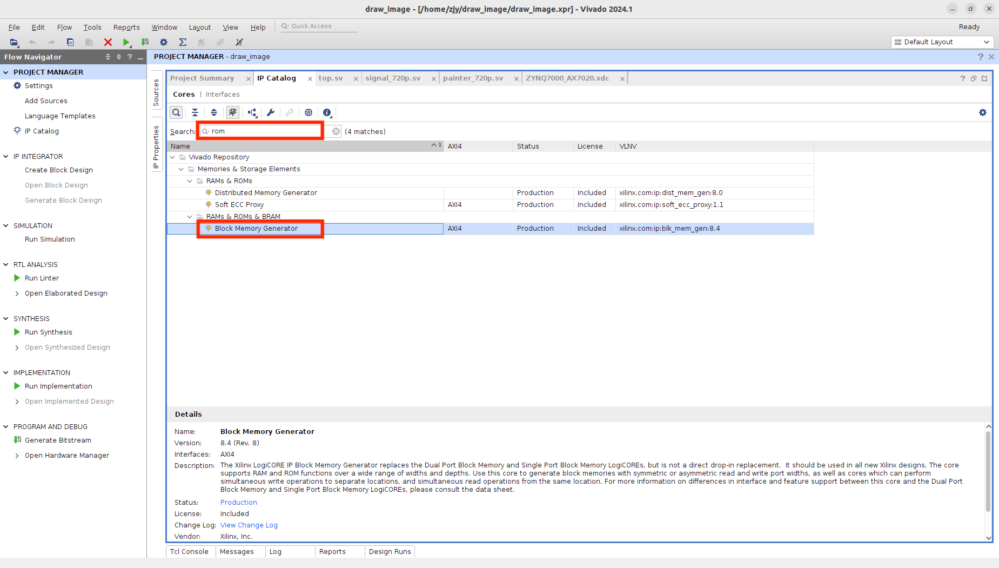
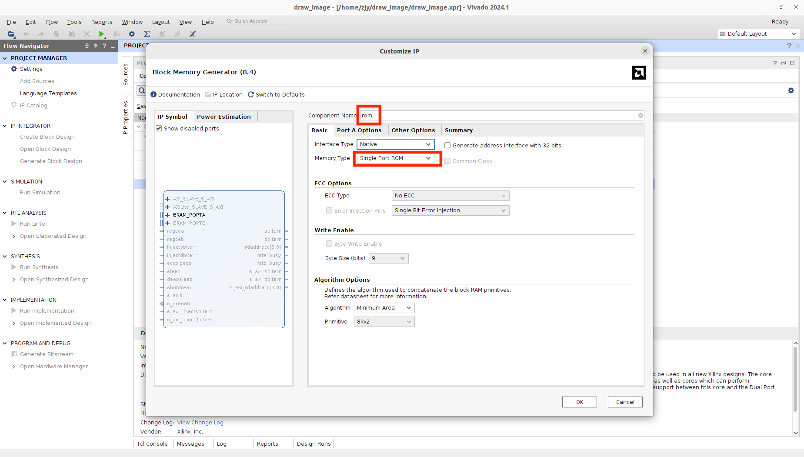
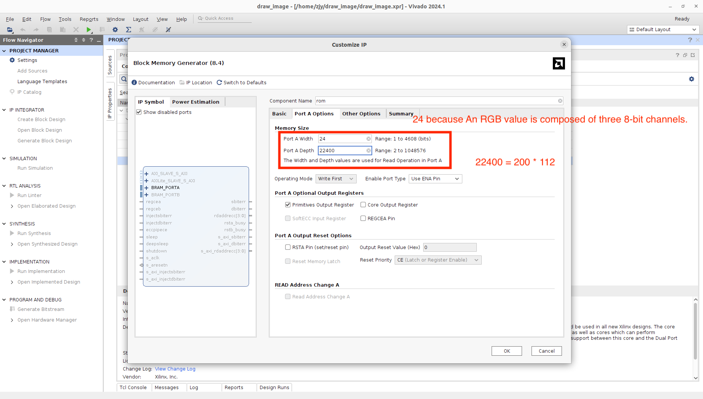
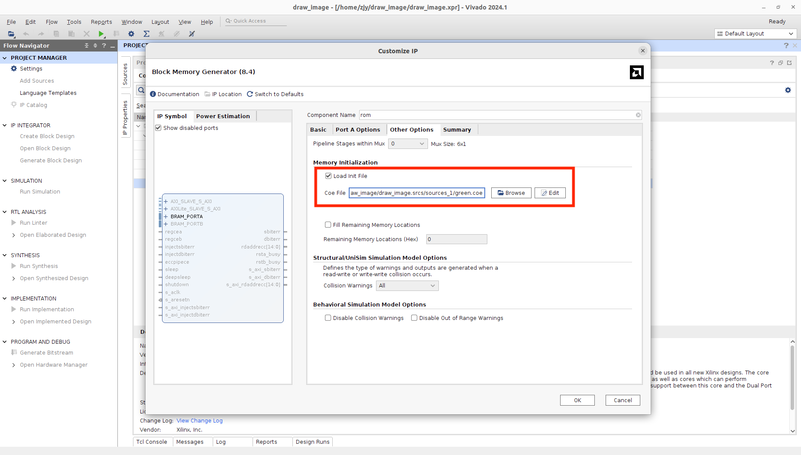
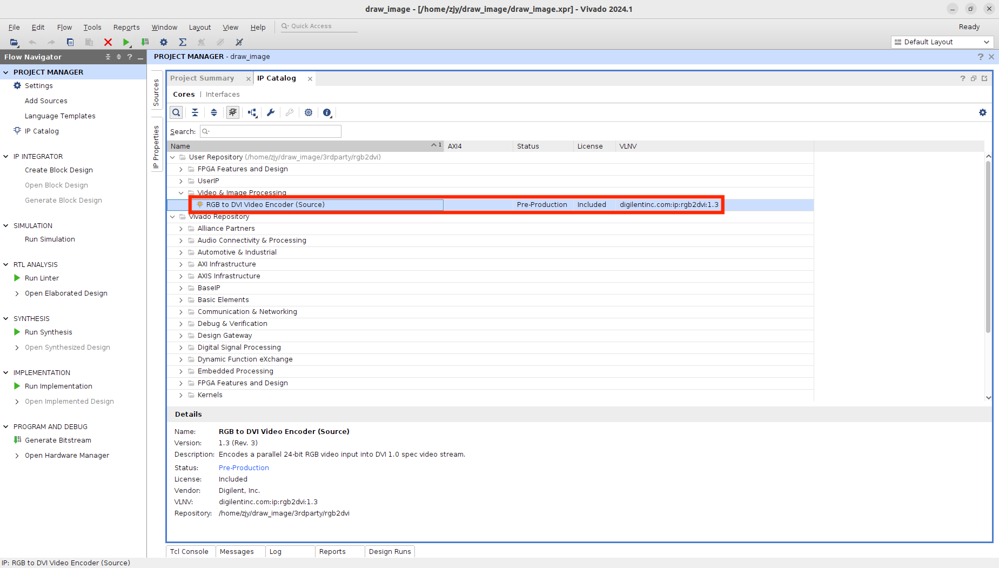
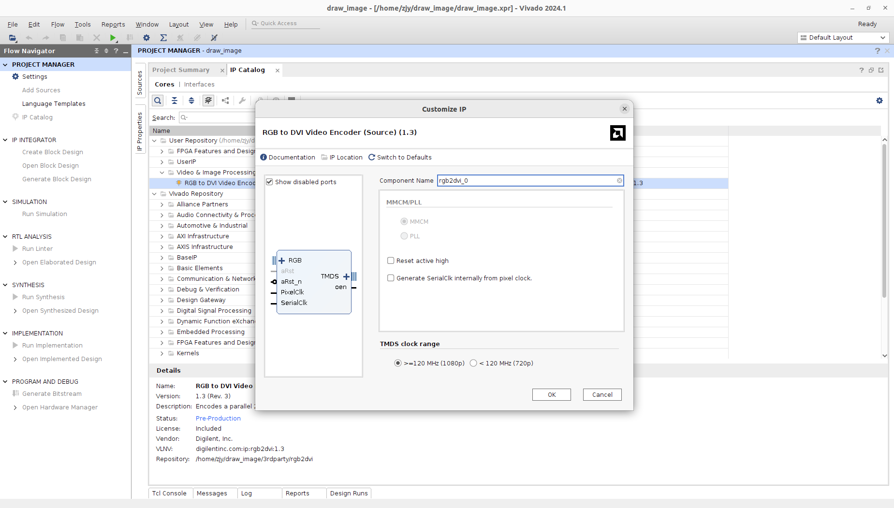
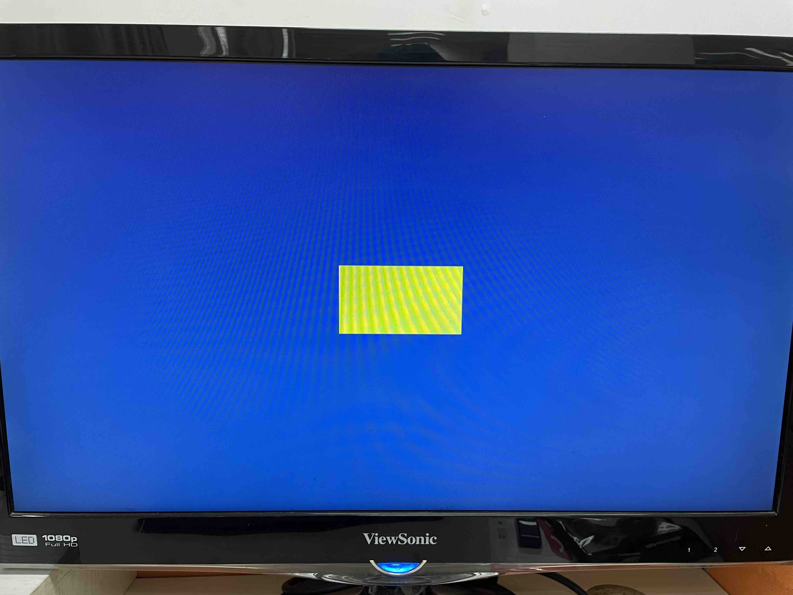

# Draw an image using FPGA

## Overview

We gonna use FPGA to draw images. Because the memory is limited, we should resize our images to a smaller resolution. And I will pick 200x112.

Firstly, we should write the image bits to the ROM. For simplicity, we use the pure green image. And then design our drawing logic. Thanks to our graphics design pattern, we don't need to change too much beside the "_**Drawing Logic**_". In _**Drawing Logic**_, we read the pixel RGB values from ROM and decide what to output. And that's it. Let's dive into the details.


## Write image RBG bits to ROM

We will use vivado's built-in ROM ip core, and it's easy to write an image to the ROM. However, we need to convert the image to [coe format](https://docs.amd.com/r/en-US/ug896-vivado-ip/COE-File-Syntax). It's not quite hard. And here is the converted file of the image below. [\[green.coe\]](https://github.com/byrzhm/digital-design/blob/main/FPGA/hdmi\_draw\_image/green.coe)

<figure><figcaption></figcaption></figure>

### Use built-in ROM ip core

<figure><figcaption></figcaption></figure>

### Name it "rom", set memory type as "Single Port ROM"

<figure><figcaption></figcaption></figure>

### Specify the memory size

<figure><figcaption></figcaption></figure>

### Use our coe file to initialize memory content

<figure><figcaption></figcaption></figure>


## Drawing Logic

We need to read the memory every pixel clock. The image size is smaller than the screen size, so we should specify the location and area of our image. The other part of the screen should painted as background color. [\[painter\_720p.sv\]](https://github.com/byrzhm/digital-design/blob/main/FPGA/hdmi\_draw\_image/painter\_720p.sv)

```verilog
module painter_720p (
    input         clk_pix, // pixel clock
    input  [10:0] sx,      // horizontal screen position
    input  [10:0] sy,      // vertical screen position
    output [7:0]  rgb_r,   // red
    output [7:0]  rgb_g,   // green
    output [7:0]  rgb_b    // blue
);

parameter IMG_POS_X  = 540;
parameter IMG_POS_Y  = 304;

parameter IMG_WIDTH  = 200;
parameter IMG_HEIGHT = 112;

wire in_img_rect;
reg [14:0] addr;
wire [23:0] dout;

assign in_img_rect = (sx >= IMG_POS_X) && (sx < IMG_POS_X + IMG_WIDTH) &&
                     (sy >= IMG_POS_Y) && (sy < IMG_POS_Y + IMG_HEIGHT);

always @(posedge clk_pix) begin
    if (in_img_rect)
        addr <= (sy - IMG_POS_Y) * IMG_WIDTH + (sx - IMG_POS_X);
    else
        addr <= 0;
end

assign {rgb_r, rgb_g, rgb_b} = (in_img_rect) ? dout : 24'h113377;

// rom ip core
rom ROM (
    .clka(clk_pix),
    .ena(in_img_rect),
    .addra(addr),
    .douta(dout)
);

endmodule
```


## Third-party rgb2dvi ip core

We gonna use third-party ip cores. IP cores are just reusable modules. It's easy to add third party ip cores into your project.

### Add Repository, i.e., add third-party ip cores

The repository is at [rgb2dvi](https://github.com/byrzhm/digital-design/tree/main/FPGA/hdmi\_draw\_image/3rdparty), comes from [digilent/vivado-library](https://github.com/Digilent/vivado-library).

<figure><figcaption></figcaption></figure>

### Use the "RGB to DVI Video Encoder"

<figure><figcaption></figcaption></figure>

### Leave it at the default settings

<figure><figcaption></figcaption></figure>


## Generate pixel clock and 5x pixel clock

<figure><figcaption></figcaption></figure>

<figure><figcaption></figcaption></figure>


## Put it all together

Here is [top.sv](https://github.com/byrzhm/digital-design/blob/main/FPGA/hdmi\_draw\_image/top.sv). The full code is at [hdmi\_draw\_image](https://github.com/byrzhm/digital-design/tree/main/FPGA/hdmi\_draw\_image).

```verilog
module top (
    input        clk_50MHz,
    output       hdmi_oen,
    output       TMDS_Clk_n,
    output       TMDS_Clk_p,
    output [2:0] TMDS_Data_n,
    output [2:0] TMDS_Data_p
);

wire clk_pix;
wire clk_pix_5x;
wire hsync;       // horizontal sync
wire vsync;       // vertical sync
wire [10:0] sx;   // horizontal screen position
wire [10:0] sy;   // vertical screen position
wire de;          // data enable
wire[7:0] rgb_r;
wire[7:0] rgb_g;
wire[7:0] rgb_b;
reg [7:0] display_r;
reg [7:0] display_g;
reg [7:0] display_b;

clock_720p clock_720p_m0 (
    // Clock in ports
    .clk_in1(clk_50MHz),
    // Clock out ports
    .clk_out1(clk_pix),
    .clk_out2(clk_pix_5x),
    // Status and control signals
    .reset(1'b0),
    .locked()
);

signal_720p signal_720p_m0 (
    .clk_pix,
    .rst_pix(1'b0),
    .sx,
    .sy,
    .hsync,
    .vsync,
    .de
);

painter_720p painter_720p_m0 (
    .clk_pix,
    .sx,
    .sy,
    .rgb_r,
    .rgb_g,
    .rgb_b
);

always_comb begin
    display_r = (de) ? rgb_r : 8'b0;
    display_g = (de) ? rgb_g : 8'b0;
    display_b = (de) ? rgb_b : 8'b0;
end

rgb2dvi_0 rgb2dvi_m0 (
    // DVI 1.0 TMDS video interface
    .TMDS_Clk_p,
    .TMDS_Clk_n,
    .TMDS_Data_p,
    .TMDS_Data_n,
    .oen(hdmi_oen),
    //Auxiliary signals 
    .aRst_n(1'b1), //-asynchronous reset; must be reset when RefClk is not within spec
    
    // Video in
    .vid_pData({display_r,display_g,display_b}),
    .vid_pVDE(de),
    .vid_pHSync(hsync),
    .vid_pVSync(vsync),
    .PixelClk(clk_pix),
    .SerialClk(clk_pix_5x)// 5x PixelClk
); 
  
endmodule
```


The output is look like this.

<figure><figcaption></figcaption></figure>


## Try your image (Optional)&#x20;

### Resize your image

We have to resize the image to fit into the limited memory. There are many useful website that can resize your image for free. Just google it.

### Convert your image to coe format

It's easy to use python pillow library to convert a image to [coe format](https://docs.amd.com/r/en-US/ug896-vivado-ip/COE-File-Syntax). Here is the template:

```python
from PIL import Image

imagename = "path/to/image"   # Change it to the real
filename = "path/to/coefile"  # Change it to the real

img = Image.open(imagename)

if img.mode != 'RGB':
    img = img.convert('RGB')
        
width, height = img.size

imgcoe = open(filename,'w')
imgcoe.write(f'; Height: {height}, Width: {width}\n')
imgcoe.write('memory_initialization_radix = 16;\n')
imgcoe.write('memory_initialization_vector =\n')

cnt = 0
for y in range(0, height):
    for x in range(0, width):
        cnt += 1

        R,G,B = img.getpixel((x,y))
        imgcoe.write(f'{R:02X}{G:02X}{B:02X}')

        if x == width - 1 and y == height - 1:
            imgcoe.write(';')
        else:
            if cnt % 32 == 0:
                imgcoe.write(',\n')
            else:
                imgcoe.write(',')
imgcoe.close()
```


It's not complete, feel free to modify it.


Now you can use the coe file to inititalize ROM. You may need to change the drawing logic parameters if you want to change the resolution or the image position.



Guess what is it? [\[test.coe\]](https://github.com/byrzhm/digital-design/blob/main/FPGA/hdmi\_draw\_image/test.coe)



## References




