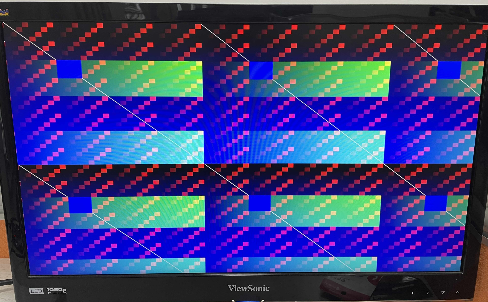

# HDMI

## Overview: You should learn VGA first!

It's a common pattern to use a rgb-to-dvi ip core to recieve VGA signals and transform them to HDMI signals. So you don't need too much knowledge about HDMI. Remember our design pattern, which is shown below. Our rgb-to-dvi instance just lies in "Video Out".

<figure><figcaption></figcaption></figure>

I don't know the details about HDMI, I just list the key points.


## Key points

### Connector

<figure><figcaption></figcaption></figure>

A standard HDMI connector has 19 pins. Out of the 19 pins, 8 are of particular interest as they form 4 TMDS differential pairs to transport the actual high-speed video info.

* TMDS clock+ and clock-
* TMDS data0+ and data0-
* TMDS data1+ and data1-
* TMDS data2+ and data2-\


<figure><figcaption></figcaption></figure>


HDMI output enable is occasionally necessary, but most of the time it is not.

<mark style="color:red;">**Does HDMI needs synchronization signals? If answer is yes, where? If answer is no, why? (answered in later sections)**</mark>



### TMDS

Video data travels on the **Transition Minimised Differential Signalling** (TMDS) physical layer in HDMI, same as DVI. TMDS signalling standard encodes 8 bits of each colour (RGB) into 10 bits. The information is then transmitted at 10x the speed of the pixel clock. This format is called `8b/10b`.

<figure><figcaption></figcaption></figure>


### Control data

`C0` and `C1` are control bits. We map **HSYNC** and **VSYNC** signals to the `C0` and `C1` ports of blue encoder. We set other control bits in green and red encoder 0.

<figure><figcaption></figcaption></figure>


Why we only map the control signals to blue encoder?



### Video timings

Similar to VGA.

<figure><figcaption></figcaption></figure>


## Source code

### TMDS encoder

The code comes from [fpga4fun](https://www.fpga4fun.com/HDMI.html). Thanks to the work of [Jean P. Nicolle](https://www.fpga4fun.com/SiteInformation.html).

```verilog
module TMDS_encoder (
	input clk,
	input [7:0] VD,  // video data (red, green or blue)
	input [1:0] CD,  // control data
	input VDE,  // video data enable, to choose between CD (when VDE=0) and VD (when VDE=1)
	output reg [9:0] TMDS = 0
);

wire [3:0] Nb1s = VD[0] + VD[1] + VD[2] + VD[3] + VD[4] + VD[5] + VD[6] + VD[7];
wire XNOR = (Nb1s>4'd4) || (Nb1s==4'd4 && VD[0]==1'b0);
wire [8:0] q_m = {~XNOR, q_m[6:0] ^ VD[7:1] ^ {7{XNOR}}, VD[0]};

reg [3:0] balance_acc = 0;
wire [3:0] balance = q_m[0] + q_m[1] + q_m[2] + q_m[3] + q_m[4] + q_m[5] + q_m[6] + q_m[7] - 4'd4;
wire balance_sign_eq = (balance[3] == balance_acc[3]);
wire invert_q_m = (balance==0 || balance_acc==0) ? ~q_m[8] : balance_sign_eq;
wire [3:0] balance_acc_inc = balance - ({q_m[8] ^ ~balance_sign_eq} & ~(balance==0 || balance_acc==0));
wire [3:0] balance_acc_new = invert_q_m ? balance_acc-balance_acc_inc : balance_acc+balance_acc_inc;
wire [9:0] TMDS_data = {invert_q_m, q_m[8], q_m[7:0] ^ {8{invert_q_m}}};
wire [9:0] TMDS_code = CD[1] ? (CD[0] ? 10'b1010101011 : 10'b0101010100) : (CD[0] ? 10'b0010101011 : 10'b1101010100);

always @(posedge clk) TMDS <= VDE ? TMDS_data : TMDS_code;
always @(posedge clk) balance_acc <= VDE ? balance_acc_new : 4'h0;
endmodule
```


It's will take time to understand what's going on inside the module, but don't worry because we have a formidable weapon: **abstraction**.


### Simple rgb2dvi converter

```verilog
module simple_rgb2dvi(
    // input signals
    input clk_pix,
    input clk_TMDS,
    input hsync,
    input vsync,
    input de,                // data enable
    input [23:0] video_data, // video data {r, g, b}
    
    // output signals
    output TMDSp_clk,
    output TMDSn_clk,
    output [2:0] TMDSn_data,
    output [2:0] TMDSp_data
);

//////////////////////////////////////////////////////////////////////////////////

reg [7:0] red, green, blue;
wire [9:0] TMDS_red, TMDS_green, TMDS_blue;

assign {red, green, blue} = video_data;

TMDS_encoder encode_R(.clk(clk_pix), .VD(red  ), .CD(2'b00)        , .VDE(de), .TMDS(TMDS_red));
TMDS_encoder encode_G(.clk(clk_pix), .VD(green), .CD(2'b00)        , .VDE(de), .TMDS(TMDS_green));
TMDS_encoder encode_B(.clk(clk_pix), .VD(blue ), .CD({vsync,hsync}), .VDE(de), .TMDS(TMDS_blue));

//////////////////////////////////////////////////////////////////////////////////

reg [3:0] TMDS_mod10 = 0;  // modulus 10 counter
reg [9:0] TMDS_shift_red = 0, TMDS_shift_green = 0, TMDS_shift_blue = 0;
reg TMDS_shift_load=0;
always @(posedge clk_TMDS) TMDS_shift_load <= (TMDS_mod10 == 4'd9);

always @(posedge clk_TMDS) begin
    TMDS_shift_red   <= TMDS_shift_load ? TMDS_red   : TMDS_shift_red  [9:1];
    TMDS_shift_green <= TMDS_shift_load ? TMDS_green : TMDS_shift_green[9:1];
    TMDS_shift_blue  <= TMDS_shift_load ? TMDS_blue  : TMDS_shift_blue [9:1];	
    TMDS_mod10 <= (TMDS_mod10 == 4'd9) ? 4'd0 : TMDS_mod10 + 4'd1;
end

assign TMDSp_data[2] = TMDS_shift_red;
assign TMDSp_data[1] = TMDS_shift_green;
assign TMDSp_data[0] = TMDS_shift_blue;

assign TMDSn_data[2] = ~TMDS_shift_red;
assign TMDSn_data[1] = ~TMDS_shift_green;
assign TMDSn_data[0] = ~TMDS_shift_blue;

assign TMDSp_clk = clk_pix;
assign TMDSn_clk = ~clk_pix;

endmodule
```


We often use third-party rgb2dvi IP cores.



### Put it all together

#### generate clock\_480p using IP cores

<figure><figcaption></figcaption></figure>

<figure><figcaption></figcaption></figure>

<figure><figcaption></figcaption></figure>


Don't leave it at the default settings. That will not work!


#### signal\_480p.sv

```verilog
module signal_480p (
    input  wire logic clk_pix,   // pixel clock
    input  wire logic rst_pix,   // reset in pixel clock domain
    output      logic [9:0] sx,  // horizontal screen position
    output      logic [9:0] sy,  // vertical screen position
    output      logic hsync,     // horizontal sync
    output      logic vsync,     // vertical sync
    output      logic de         // data enable (low in blanking interval)
);

    // horizontal timings
    parameter HA_END = 639;           // end of active pixels
    parameter HS_STA = HA_END + 16;   // sync starts after front porch
    parameter HS_END = HS_STA + 96;   // sync ends
    parameter LINE   = 799;           // last pixel on line (after back porch)

    // vertical timings
    parameter VA_END = 479;           // end of active pixels
    parameter VS_STA = VA_END + 10;   // sync starts after front porch
    parameter VS_END = VS_STA + 2;    // sync ends
    parameter SCREEN = 524;           // last line on screen (after back porch)

    always_comb begin
        hsync = ~(sx >= HS_STA && sx < HS_END);  // invert: negative polarity
        vsync = ~(sy >= VS_STA && sy < VS_END);  // invert: negative polarity
        de = (sx <= HA_END && sy <= VA_END);
    end

    // calculate horizontal and vertical screen position
    always_ff @(posedge clk_pix) begin
        if (sx == LINE) begin  // last pixel on line?
            sx <= 0;
            sy <= (sy == SCREEN) ? 0 : sy + 1;  // last line on screen?
        end else begin
            sx <= sx + 1;
        end
        if (rst_pix) begin
            sx <= 0;
            sy <= 0;
        end
    end
endmodule
```

#### painter\_480p.sv

```verilog
module painter_480p (
    input wire logic       clk_pix,
    input wire logic [9:0] sx,
    input wire logic [9:0] sy,
    output     logic [7:0] rgb_r,
    output     logic [7:0] rgb_g,
    output     logic [7:0] rgb_b
);

wire [7:0] W = {8{sx[7:0]==sy[7:0]}};
wire [7:0] A = {8{sx[7:5]==3'h2 && sy[7:5]==3'h2}};

always @(posedge clk_pix) rgb_r <= ({sx[5:0] & {6{sy[4:3]==~sx[4:3]}}, 2'b00} | W) & ~A;
always @(posedge clk_pix) rgb_g <= (sx[7:0] & {8{sy[6]}} | W) & ~A;
always @(posedge clk_pix) rgb_b <= sy[7:0] | W | A;

endmodule
```


#### top.sv

```verilog
module top (
    input        sys_clk,
    output       TMDSn_clk,
    output       TMDSp_clk,
    output [2:0] TMDSn_data,
    output [2:0] TMDSp_data
);

////////////////////// clock generator ////////////////////
wire clk_pix, clk_TMDS;
clock_480p clock_480p_m0 (
    .clk_in1(sys_clk),
    .clk_out1(clk_pix),
    .clk_out2(clk_TMDS),
    .reset(1'b0),
    .locked()
);

////////////////////// signal generator ////////////////////
wire [9:0] sx, sy;
wire hsync, vsync, de;
signal_480p signal_480p_m0 (
    .clk_pix,
    .rst_pix(1'b0),
    .sx,
    .sy,
    .hsync,
    .vsync,
    .de
);

////////////////////// drawing logic ////////////////////
reg [7:0] rgb_r, rgb_g, rgb_b;
painter_480p painter_480p_m0 (
    .clk_pix,
    .sx,
    .sy,
    .rgb_r,
    .rgb_g,
    .rgb_b
);

////////////////////// rgb2dvi converter ////////////////////
simple_rgb2dvi simple_rgb2dvi_m0 (
    .clk_pix,
    .clk_TMDS,
    .hsync,
    .vsync,
    .de,
    .video_data({rgb_r, rgb_g, rgb_b}),
    
    // output signals
    .TMDSp_clk,
    .TMDSn_clk,
    .TMDSn_data,
    .TMDSp_data
);

endmodule
```


Use PLL or MMCM ip cores to generate pixel clock and TMDS clock.



### Test

Our test board is ZYNQ7000 AX7020. The pins assignment file is given at [ZYNQ7000-AX7020.xdc](https://github.com/byrzhm/digital-design/blob/main/FPGA/hdmi\_test/ZYNQ7000\_AX7020.xdc).

```
set_property PACKAGE_PIN U18 [get_ports sys_clk]
set_property IOSTANDARD LVCMOS33 [get_ports sys_clk]
create_clock -period 20.000 -waveform {0.000 10.000} [get_ports sys_clk]

#set_property PACKAGE_PIN V16 [get_ports hdmi_oen]
#set_property IOSTANDARD LVCMOS33 [get_ports hdmi_oen]

set_property PACKAGE_PIN V20 [get_ports {TMDSp_data[0]}]
set_property IOSTANDARD LVCMOS33 [get_ports {TMDSp_data[0]}]
set_property PACKAGE_PIN W20 [get_ports {TMDSn_data[0]}]
set_property IOSTANDARD LVCMOS33 [get_ports {TMDSn_data[0]}]

set_property PACKAGE_PIN T20 [get_ports {TMDSp_data[1]}]
set_property IOSTANDARD LVCMOS33 [get_ports {TMDSp_data[1]}]
set_property PACKAGE_PIN U20 [get_ports {TMDSn_data[1]}]
set_property IOSTANDARD LVCMOS33 [get_ports {TMDSn_data[1]}]

set_property PACKAGE_PIN N20 [get_ports {TMDSp_data[2]}]
set_property IOSTANDARD LVCMOS33 [get_ports {TMDSp_data[2]}]
set_property PACKAGE_PIN P20 [get_ports {TMDSn_data[2]}]
set_property IOSTANDARD LVCMOS33 [get_ports {TMDSn_data[2]}]

set_property PACKAGE_PIN N18 [get_ports TMDSp_clk]
set_property IOSTANDARD LVCMOS33 [get_ports TMDSp_clk]
set_property PACKAGE_PIN P19 [get_ports TMDSn_clk]
set_property IOSTANDARD LVCMOS33 [get_ports TMDSn_clk]
```


Here is our screen output.

<figure><figcaption></figcaption></figure>


## References










