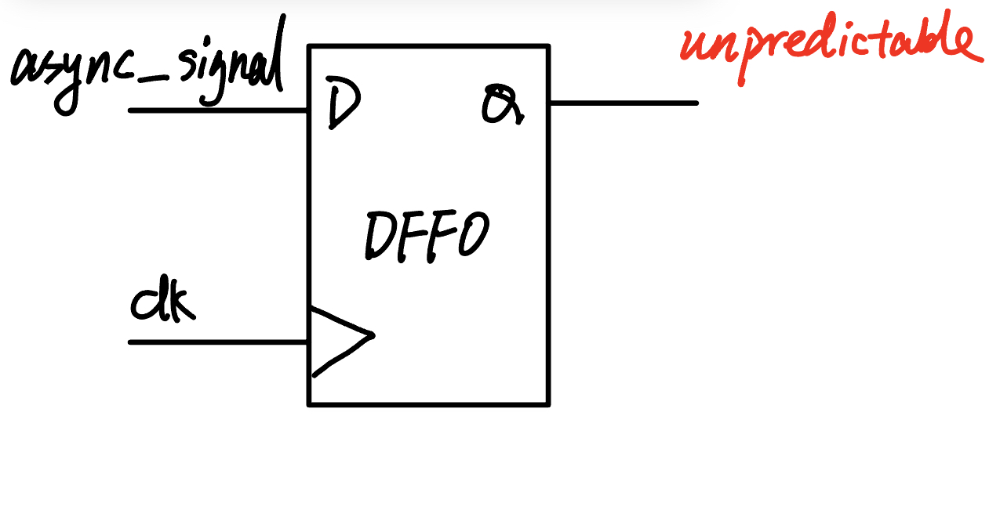
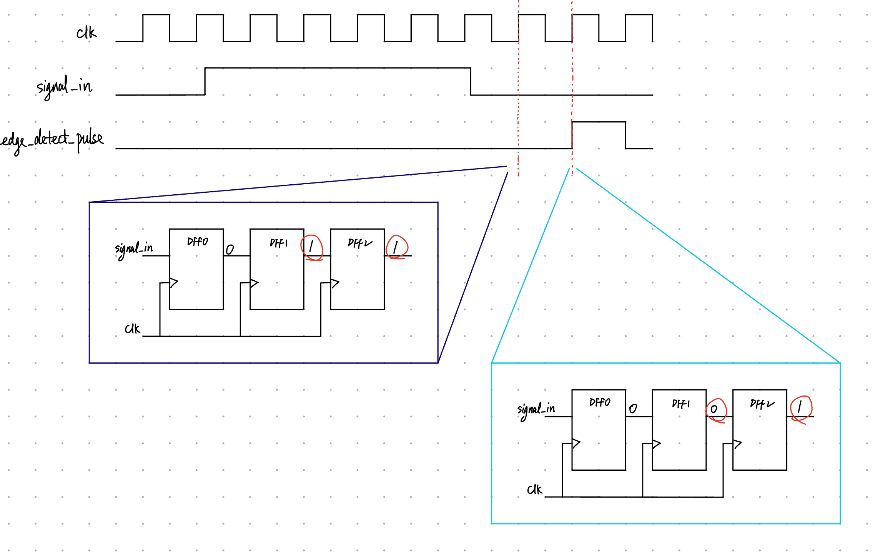
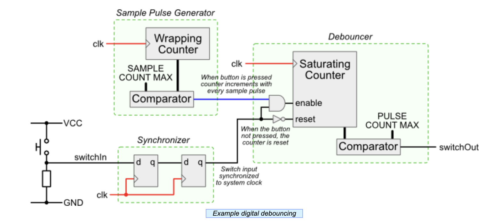

# Input Conditioning Circuits

## Problems

Often we use buttons or switches as inputs of a sequential circuit. The circuit looks like this:

For example, you implement a counter inside your FPGA. When press one button, it increases by one,
 and when press another one, it decreases by one.

You press the button ten times but the counter increases by 33. It's not nice.

<figure><figcaption></figcaption></figure>

<figure><figcaption></figcaption></figure>

## Synchronizer

First, the button signals is asynchronous which means they don't have a associated clock.
 That will put the register into *metastable* state.

<figure><figcaption></figcaption></figure>

The solution is to use a synchronizer circuit that will safely bring an asynchronous signal into a clock domain.
 Here is a simple synchronizer circuit.

<figure><figcaption>1-bit 2 Flip-Flop Synchronizer</figcaption></figure>

## Edge Detector

Edge Detector convert the low-to-hign transition of a button press to a clock wide pulse.

<figure><figcaption>an edge detector</figcaption></figure>

Here is the timing diagram.

<figure><figcaption>Edge Detector Timing Diagram</figcaption></figure>

## Debouncer

Here is a simple debouncer circuit. Note that we have implemented synchronizer before.

<figure><figcaption>Architecture of a simple debouncer circuit. <a href="http://www.labbookpages.co.uk/electronics/debounce.html">Source</a></figcaption></figure>

The basic idea is to use a counter to time how long the switch signal has been high. If the signal has been high continuously for a set amount of time, then it is considered pressed and stable.



How to choose sensible **SAMPLE_COUNT_MAX** and **PULSE_COUNT_MAX**?



## References

* Don't miss the awesome [lab](https://github.com/EECS150/fpga_labs_sp24/tree/main/lab3#input-conditioning-circuits) offered by UCB
* This [post](https://www.doulos.com/knowhow/fpga/synchronization-and-edge-detection/) explains edge detection vividly
* The [fpga4fun's post](https://www.fpga4fun.com/Debouncer.html) is simple and straightforward
