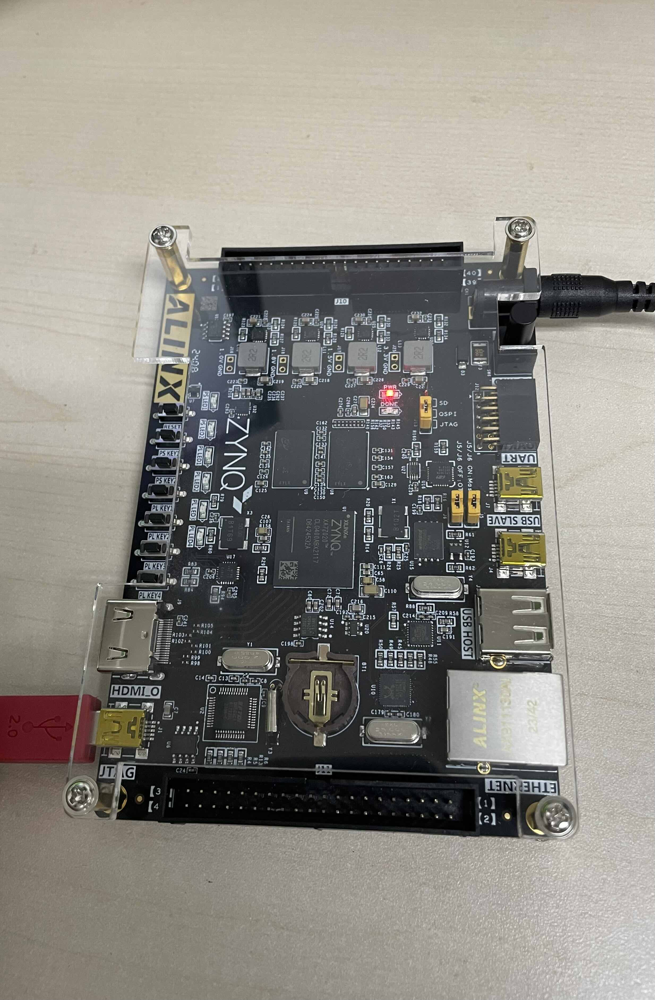
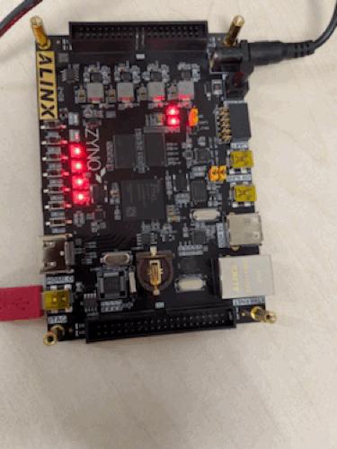

# Get started with vivado 24.1

## Create a project

Open vivado, and then click `Create Project`.

<figure><figcaption></figcaption></figure>


Specify the project name and location. I use the breathing light circuit to demonstrate.&#x20;

<figure><figcaption></figcaption></figure>


Select `RTL Project` and check `Do not specify sources at this time`.

<figure><figcaption></figcaption></figure>


Our device information is at [Our device](broken-reference)

<figure><figcaption></figcaption></figure>


To create the project, click `Finish`.

<figure><figcaption></figcaption></figure>


## Design

Now, it's time to add our verilog design source code.

<figure><figcaption></figcaption></figure>


First click `Create File`, and then specify the `File type` to `SystemVerilog` and `File name` to `led`.

<figure><figcaption></figcaption></figure>

Here is `led.sv`. You can paste it in.

```verilog
module led (
    input sys_clk,
    input rst_n,
    output reg [3:0] led);
    
    parameter PERIOD = 32'd49_999_999;
    
    reg [31:0] timer_cnt;
    
    always@(posedge sys_clk or negedge rst_n) begin
        if (!rst_n) begin
            led <= 4'd0;
            timer_cnt <= 32'd0;
        end else if (timer_cnt >= PERIOD) begin
            led <= ~led;
            timer_cnt <= 32'd0;
        end else begin
            led <= led;
            timer_cnt <= timer_cnt + 32'd1;
        end
    end
    
endmodule
```

<figure><figcaption></figcaption></figure>

## Simulation

It's a good habit to write testbench for your verilog code. If you don't know how to write a testbench or you don't familiar with it, you should check the tutorials released by [EDAPlayground](https://www.edaplayground.com/), and here is the [link](https://www.youtube.com/playlist?list=PLScWdLzHpkAfbPhzz1NKHDv2clv1SgsMo).

<figure><figcaption></figcaption></figure>

Just name it `testbench`.

<figure><figcaption></figcaption></figure>

Here is `testbench.sv`.  You can change the code as long as you fully understand it.

```verilog
`timescale 1ns / 1ps

module testbench;

    reg clk, rst_n;
    wire [3:0] led;
    
    led #(.PERIOD(4)) dut (
        .sys_clk(clk),
        .rst_n(rst_n),
        .led(led)
        );
        
    initial begin
        clk = 0;
        rst_n = 0;
        #5 rst_n = 1;
        
        #50;
        
        rst_n = 0;
        $5 $finish;
    end
    
    always #5 clk = ~clk;
    
endmodule
```

<figure><figcaption></figcaption></figure>


First click `Run Simulation`, and then click `Run Behavioral Simulation` to run simulation.

<figure><figcaption></figcaption></figure>


Here is the waveform.

<figure><figcaption></figcaption></figure>


Maybe you need to scale the waveform down. And you can drag dut (design under test) instance to the waveform to see the signals inside the instance.



## &#x20;Schematic

Click `Open Elaborated Design`.

<figure><figcaption></figcaption></figure>

<figure><figcaption></figcaption></figure>


Click `Schematic`, and then you can see an intuitive diagram showing up in the editor area.

<figure><figcaption></figcaption></figure>


## Pin planning

In `I/O Ports` window, set the `Package Pin` and `I/O Std`. The settings is related to our [device details](broken-reference).

<figure><figcaption></figcaption></figure>

Click the upper left corner save icon to save the constrains. Just name it `led`.

<figure><figcaption></figcaption></figure>

You can see `led.xdc` created in your project.

<figure><figcaption></figcaption></figure>

## Synthesis

Now run synthesis.

<figure><figcaption></figcaption></figure>

When synthesis completed, click `Cancel`. Because we need to add timing constraints first.

<figure><figcaption></figcaption></figure>


## Timing Constraints

Click `Contraints Wizard` and then click `Next`.

<figure><figcaption></figcaption></figure>

Set the timing constraints and then click `Skip to Finish`.

<figure><figcaption></figcaption></figure>

Click `Finish`.

<figure><figcaption></figcaption></figure>

You can see the timing constraints in `led.xdc` automatically generated.

<figure><figcaption></figcaption></figure>

## Generate Bitstream

Click `Generate Bitstream`.


If you haven't run implementation before, vivado will give you a hint to run implementation and you just run it.


<figure><figcaption></figcaption></figure>

When bitstream generation completed, check `Open Hardware Manager` and then click `OK`.

<figure><figcaption></figcaption></figure>

Make sure our device is connected and power on.

<figure><figcaption></figcaption></figure>

Click `Open target` and then click `auto connect`. If the cable driver is correctly installed, you can see our device in the hardware window.

<figure><figcaption></figcaption></figure>


Possible solutions to "vivado cannot find your device" (linux version):

`cd` to directory  "`/path/to/Xilinx/Vivado/<vivado-version>/data/xicom/cable_drivers/lin64/install_script/install_drivers`".

* change "/path/to" to the real path to Xilinx for example "/tools" or "/opt"
* change "\<vivado-version>" to the real vivado version for example "2024.1"
* In the directory, there is a `install_drivers`  script (same name as the directory name), run using command `sudo ./install_drivers`


<figure><figcaption></figcaption></figure>

Right click our device `xc7z020_1`, and then click `Program Device`.

<figure><figcaption></figcaption></figure>


Leave it the default Bitstream File and click `Program`.

<figure><figcaption></figcaption></figure>


Now, you can see the breathing light effect.

<figure><figcaption></figcaption></figure>

## References




