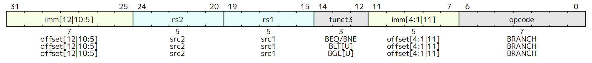
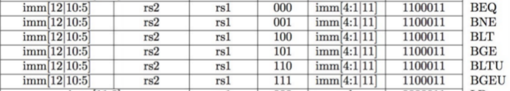

# B-type


All branch instructions use the B-type instruction format.

* E.g., `BEQ x1, x2, Label`
* Branches read two registers but don't write a register (similar to stores)


## B-Format Instruction Layout

<figure><figcaption></figcaption></figure>

* B-Format is similar to S-Format, with two register sources (rs1/rs2) and a 12-bit immediate
* The 12 immediate bits encode 13-bit signed byte offsets (low bit of offset is always zero, so no need to store it)
* But now immediate represents values `-2^12` to `+2^12 - 1` in 2-byte increments

## Branch Instructions

<figure><figcaption></figcaption></figure>
