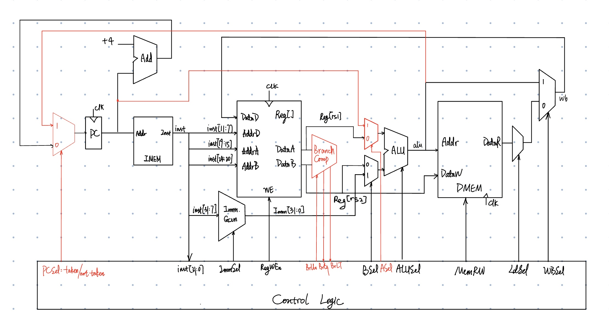

# B-type


All branch instructions use the B-type instruction format.

* E.g., `BEQ x1, x2, Label`
  * if x1 == x2 then pc <- pc + offset
  * offset computed by compiler/assembler and stored in the immediate field(s)
* Branches read two registers but don't write a register (similar to stores)


## B-Format Instruction Layout

<figure><figcaption></figcaption></figure>

* B-format is similar to S-format, with two register sources (rs1/rs2) and a 12-bit immediate
* The 12 immediate bits encode 13-bit signed byte offsets (low bit of offset is always zero, so no need to store it)
* But now immediate represents values `-2^12` to `+2^12 - 1` in 2-byte increments

## Encoding Example

<figure><figcaption></figcaption></figure>



In the RISC-V architecture, instructions are typically 32 bits (4 bytes) in length and are aligned on 4-byte boundaries. This means that the addresses of these instructions are multiples of 4. Consequently, the lower two bits of an instruction address are always zero.

So why branch immediates only discard the LSB not the low 2 bits?



## Immediate Encoding (So Far)

<figure><figcaption></figcaption></figure>

## Adding Branches to Datapath

<figure><figcaption></figcaption></figure>

### Branch Comparator

<figure><figcaption></figcaption></figure>

## All RISC-V Branch Instructions

<figure><figcaption></figcaption></figure>
