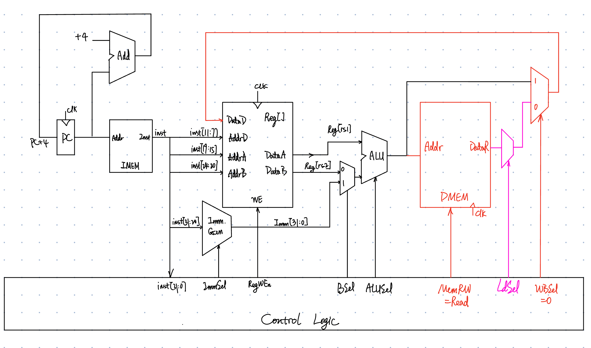

# I-type

## I-Format Instruction Layout

<figure><figcaption></figcaption></figure>

* The `funct7` and `rs2` fields from R-Format are replaced by 12-bit signed immediate, `imm[11:0]` (in range \[-2048, 2047]).
* Remaining fields (`rs1`, `funct3`, `rd`, `opcode`) same as R-Format.
* Immediate is always sign-extended to 32-bits before use in an arithmetic operation.

### I-immediate

<figure><figcaption></figcaption></figure>

<figure><figcaption>
Immediate generator generates I-type immediate
</figcaption></figure>

## I-Format Arithmetic Instructions

<figure><figcaption>
I-Format Arithmetic Instructions
</figcaption></figure>

### Adding I-Format arithmetic instructions to datapath

<figure><figcaption></figcaption></figure>

## I-Format Load Instructions

Load instructions are also I-type.

<figure><figcaption>
Load Instruction Layout
</figcaption></figure>

* Reg\[rd] <- Mem\[Reg\[rs1] + offset]
  * The 12-bit immediate is added to the base address in `rs1` to form the memory address
  * The value loaded from memory is stored in register `rd`

<figure><figcaption>
I-Format Load Instructions
</figcaption></figure>


Note that the `funct3` field is to specify the width (i.e., the amount of bytes) and signedness of load data.


### Adding load instructions to datapath

<figure><figcaption></figcaption></figure>
