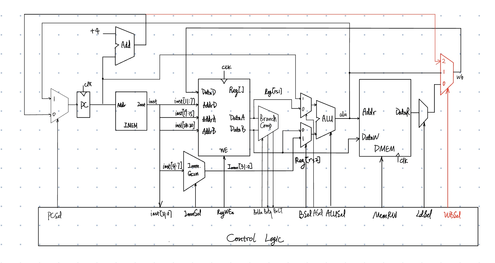

# J-type

<figure><figcaption></figcaption></figure>

## JALR (I-Format)



I'm sorry for putting JALR here. Actually JALR is I-type.



<figure><figcaption></figcaption></figure>

* `JARL rd, rs1, imm`
  * Reg[rd] <- PC + 4; PC <- Reg[rs1] + imm;
    * Write `PC + 4` to Reg[rd] (*return address*)
    * Sets PC = Reg[rs1] + offset



Don't need to multiply the immediate by 2.



### Adding `JALR` to datapath

<figure><figcaption></figcaption></figure>

## JAL

<figure><figcaption></figcaption></figure>

### Adding `JAL` to datapath



What should be added to datapath?


