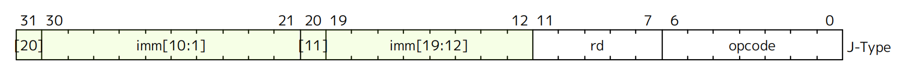
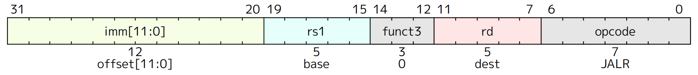
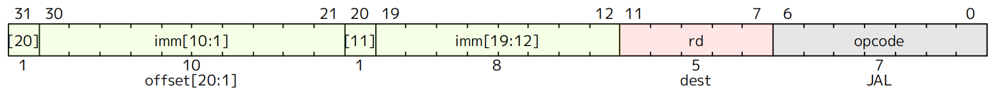

# J-type

<figure><figcaption></figcaption></figure>



I'm sorry for putting JALR here. Actually JALR is I-type.



<figure><figcaption></figcaption></figure>

<figure><figcaption></figcaption></figure>
