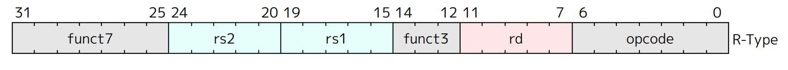
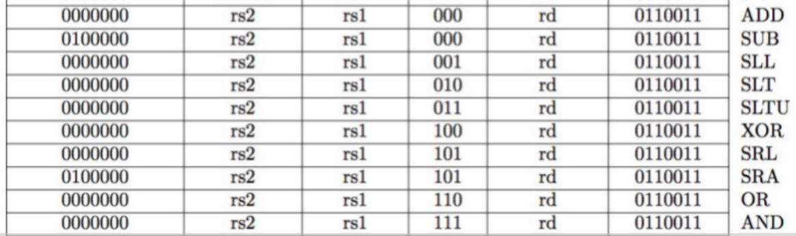
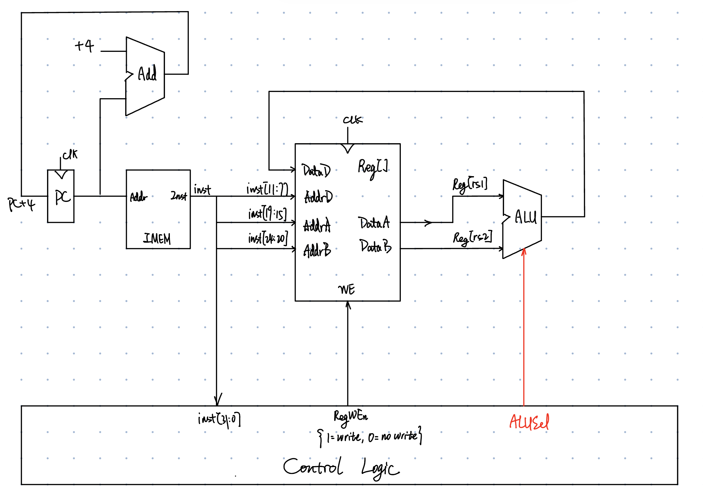

# R-type

## R-Format Instruction Layout

<figure><figcaption></figcaption></figure>

* *opcode*: partially specifies what instruction it is
  * Note: This field is equal to $\textcolor{red}{0110011_{two}}$ for all R-Format register-register arithmetic instructions
* *funct7 + funct3*: combined with *opcode*, these two fields describe what operation to perform

 

* *rs1*(Source Register #1): specifies register containing first operand
* *rs2*: specifies second register operand
* *rd*(Destination Register): specifies register which will receive result of computation



Each register field holds a 5-bit unsigned integer (0-31) corresponding to a register number (x0-x31)



## R-Format Instructions

<figure><figcaption>R-type instructions</figcaption></figure>



Decoding *funct7* and *funct3* fields to select appropriate ALU functions.



## Datapath

Here is our datapath for R-Format instructions.

<figure><figcaption></figcaption></figure>
