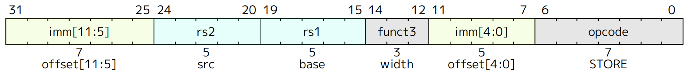
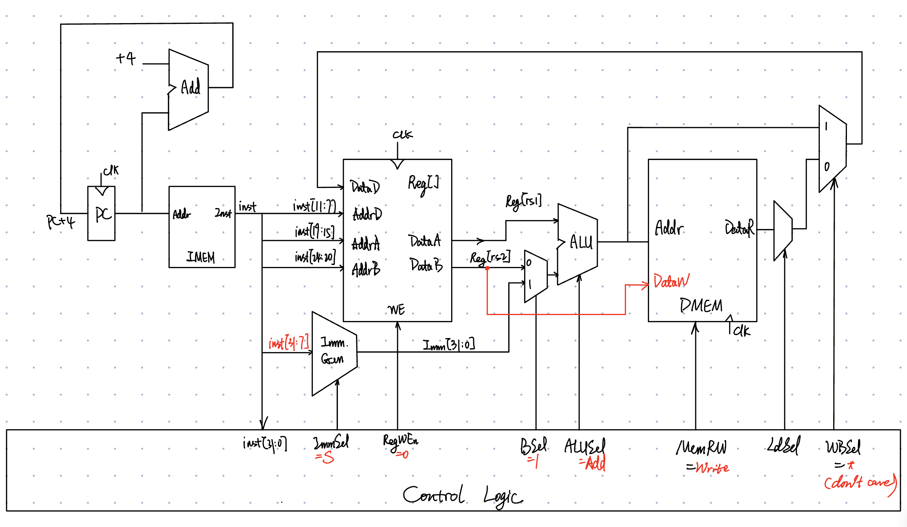

# S-type



S-type instructions are used for store.



## S-Format Instruction Layout

<figure><figcaption></figcaption></figure>

* $\rm Mem[Reg[rs1] + offset] \leftarrow Reg[rs2]$



**Immediate in two parts**

* Can't have both *rs2* and *immediate* in same place as other instructions
* RISC-V design decision is move low 5 bits of immediate to where rd field was in other instructions - keep rs1/rs2 fields in same place
  * register names more critical than immediate bits in hardware design



## I+S Immediate Generation

<figure><figcaption></figcaption></figure>

* Just need a 5-bit mux between two positions where low five bits of immediate can reside in instruction
* Other bits in immediate are wired to fixed positions in instruction

## Store Instructions

<figure><figcaption></figcaption></figure>

## Datapath

<figure><figcaption></figcaption></figure>



How to control the amount of bytes to write to memory?


