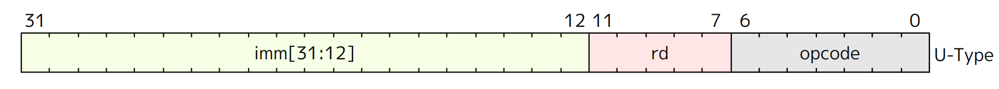
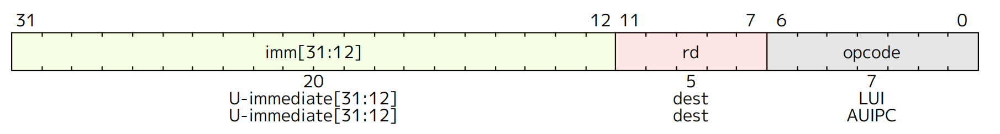
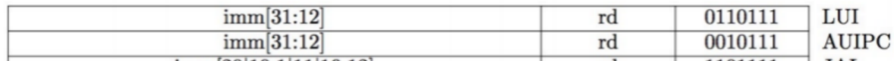

# U-type

## U-Format Instruction Layout

<figure><figcaption></figcaption></figure>

## U-Format Instructions

<figure><figcaption></figcaption></figure>

<figure><figcaption></figcaption></figure>

* LUI - Load Upper Immediate
  * `Reg[rd] = {imm, 12'b0}`

* AUIPC - Add Upper Immediate to PC
  * `Reg[rd] = PC + {imm, 12'b0}`

>
> The combination of an AUIPC and the 12-bit immediate in a JALR can transfer control
> to any 32-bit PC-relative address, while an AUIPC plus the 12-bit immediate offset
> in regular load or store instructions can access any 32-bit PC-relative data address.
> 
> The current PC can be obtained by setting the U-immediate to 0. Although a JAL +4
> instruction could also be used to obtain the local PC (of the instruction following the JAL),
> it might cause pipeline breaks in simpler microarchitectures or pollute BTB structures in
> more complex microarchitectures.
>

## Adding U-Format instructions to datapath



What should be added to datapath?


