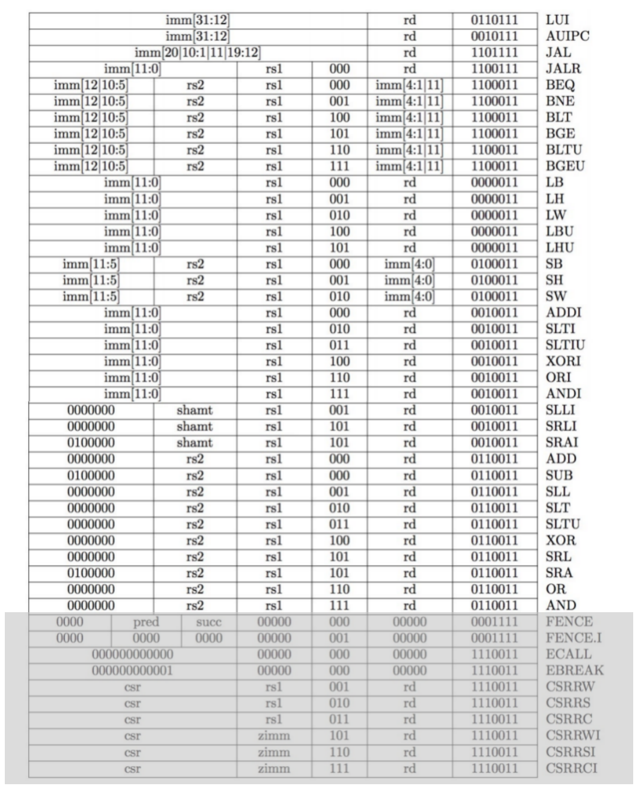
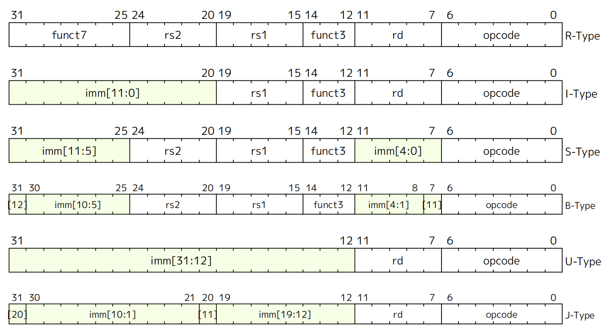
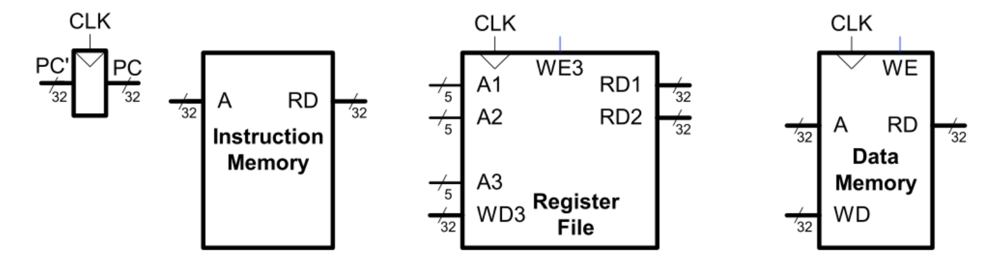
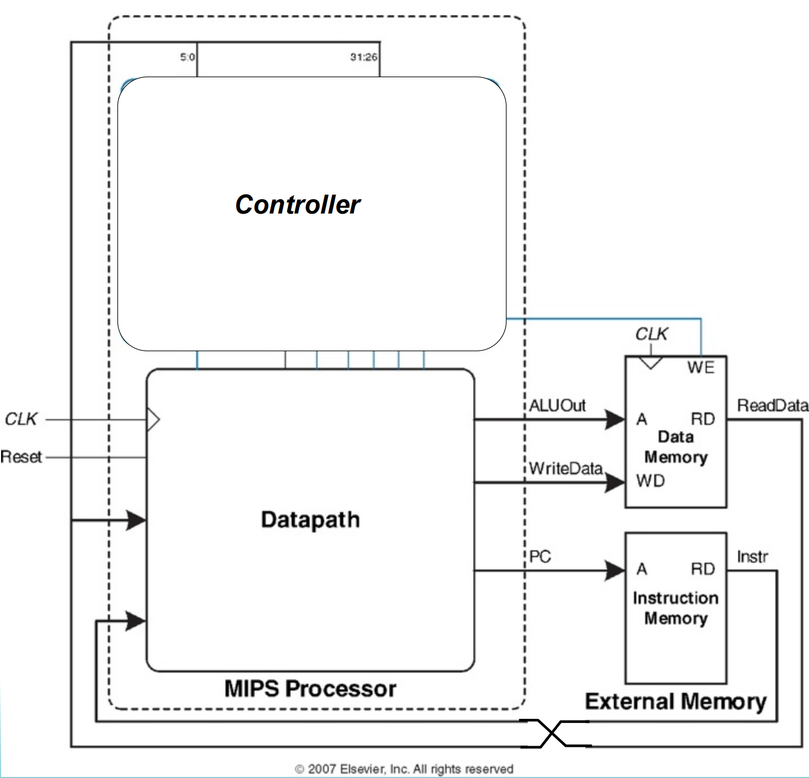

# RISC-V Microarchitecture

## Complete RV32I ISA

Here is the complete RV32I ISA. We gonna implement most part of it except the gray part.

<figure><figcaption>Complete RV32I ISA</figcaption></figure>



We are not going to handle *exceptions*.



## RISC-V Instruction Formats

The RV32I ISA can be divided into six intruction formats(R/I/S/B/U/J), as shown in the figure below.

<figure><figcaption>RISC-V Instruction Formats</figcaption></figure>

## "State" Required by RV32I ISA

***Processors are basically FSMs.*** Each instruction reads and updates this state during execution:

* Registers (`x0` .. `x31`)
* Program Counter (PC)
* Memory (MEM)



`x0` is hardwired to 0 (always 0). Writes to `Reg[0]` are ignored.



<figure><figcaption>RISC-V state elements</figcaption></figure>

## Microarchitecture Organization

<figure><figcaption>RISC-V state elements</figcaption></figure>

## Microarchitecture

There are multiple implementations for a single instruction set architecture:

* Single-cycle
  * Each instruction executes in a single clock cycle.
* Multicycle
  * Each instruction is broken up into a series of shorter steps with one step per clock cycle.
* Pipelined (variant on "multicycle")
  * Each instruction is broken up into a series of steps with one step per clock cycle.
  * Multiple instructions execute at once by overlapping in time.
* Superscalar
  * Multiple functional units to execute at once by overlapping in time.
* Out of order
  * Instructions are reordered by the hardware.



We will implement a single-cycle processor first, and then a pipelined one.



## References

* The RISC-V related lectures of [EECS151/251A](https://www.eecs151.org)
