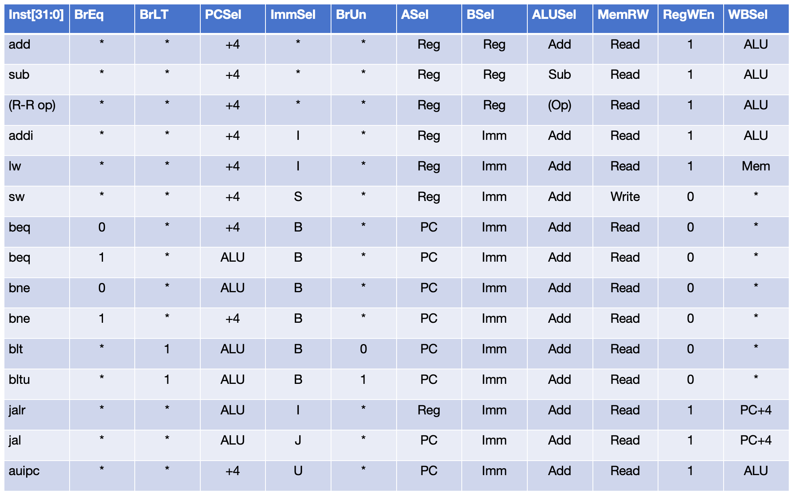
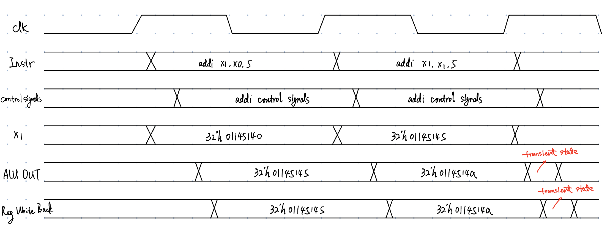

# Single Cycle

We have built the complete RV32I datapath. Now we gonna design the control unit.

<figure><figcaption></figcaption></figure>

## Control Unit

<figure><figcaption></figcaption></figure>



* Some instructions are omitted, for example, `bge` and `bgeu`.
* LdSel signal is omitted.



## Timing



Think of the following questions carefully. You need to find the answer on your own through your own effort.

**1. Why an instruction can be executed in single cycle in a single-cycle processor?**

**2. What properties are needed for instruction memory, data memory and register file?**

**3. What if the instruction memory or data memory or register file can only be read synchronously?**

**4. What's the possible critical path of single-cycle processor?**



<figure><figcaption></figcaption></figure>

Basically, each instruction comes in at its first rising clock edge and finish at
its second rising clock edge (often write its result back).
