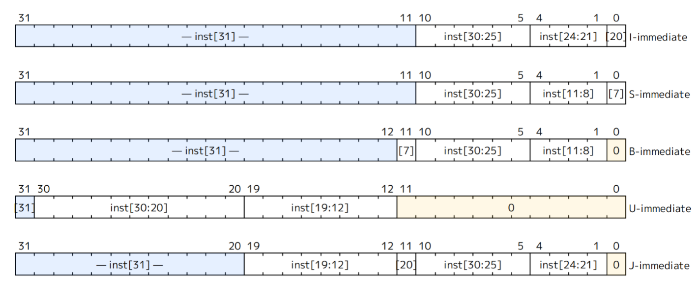

# Implementation

## Implementation Overview

First, we will implement the basic elements, i.e., PC, memory, register file and ALU.
Then we will connect these elements together. The control unit will be easy to implement,
because RV32I is basically a nine-bit ISA!

<figure><figcaption></figcaption></figure>

## Basic Elements

### PC

PC is just a 32-bit register.



Only the low bits of PC are useful, because the intruction memory is limited.
The low two bits of PC are always zero, how to utilize it?



### Memory



To implement a single-cycle processor, we need asynchronous
read instruction and data memory.



#### Instruction Memory

For simplicity, IMEM is not writable, i.e, it's a ROM.

Check my [implementation](https://github.com/byrzhm/SimpleRV/blob/main/single-cycle/src/imem.sv) here.

#### Data Memory

Data memory should be synchronous write and asynchronous read RAM.



How to support `sb`, `sh` and `sw`?



Check my [implementation](https://github.com/byrzhm/SimpleRV/blob/main/single-cycle/src/dmem.sv).

### Register File

Our register file should be synchronous write and asynchronous read.



Remember x0 is wired to 0.



Check my [implemention](https://github.com/byrzhm/SimpleRV/blob/main/single-cycle/src/register_file.sv).

### ALU

ALU should support following operations:

* ADD:  y = a + b
* SUB:  y = a - b
* AND:  y = a & b
* OR:   y = a | b
* XOR:  y = a ^ b
* SLL:  y = a << b
* SRL:  y = a >> b
* SRA:  y = $signed(a) >>> b
* SLT:  y = ($signed(a) < $signed(b)) ? 1 : 0
* SLTU: y = (a < b) ? 1 : 0



When doing shift, only the low 5 bits of b are useful.



Here is my [implementation](https://github.com/byrzhm/SimpleRV/blob/main/single-cycle/src/alu.sv).

### Immediate Generator

<figure><figcaption></figcaption></figure>

```verilog
module immgen (
    input      [31:7]                instr,
    input      [`IMM_TYPE_WIDTH-1:0] imm_sel,
    output reg [31:0]                imm_out
);

    always @(*) begin
        case (imm_sel)
            `IMM_I: imm_out = {{21{instr[31]}}, instr[30:20]};
            `IMM_S: imm_out = {{21{instr[31]}}, instr[30:25], instr[11:7]};
            `IMM_B: imm_out = {{20{instr[31]}}, instr[7], instr[30:25], instr[11:8], 1'b0};
            `IMM_U: imm_out = {instr[31:12], 12'b0};
            `IMM_J: imm_out = {{12{instr[31]}}, instr[19:12], instr[20], instr[30:21], 1'b0};
            default: imm_out = 0;
        endcase
    end

endmodule
```

### Comparator

```verilog
module comparator #(
    parameter DWIDTH = 32
) (
    input [DWIDTH-1:0] a,
    input [DWIDTH-1:0] b,
    input br_un,
    output br_eq,
    output br_lt
);

    assign br_eq = (a == b);
    assign br_lt = (br_un) ? (a < b) : ($signed(a) < $signed(b));

endmodule
```

## Control Unit

RV32I is basically a nine bit ISA. If you get stuck, check my [implementation](https://github.com/byrzhm/SimpleRV/blob/main/single-cycle/src/controller.sv).

## Connect all the components

It's not very hard to connect all the components. If you don't know what to do,
check the complete datapath we have built.
